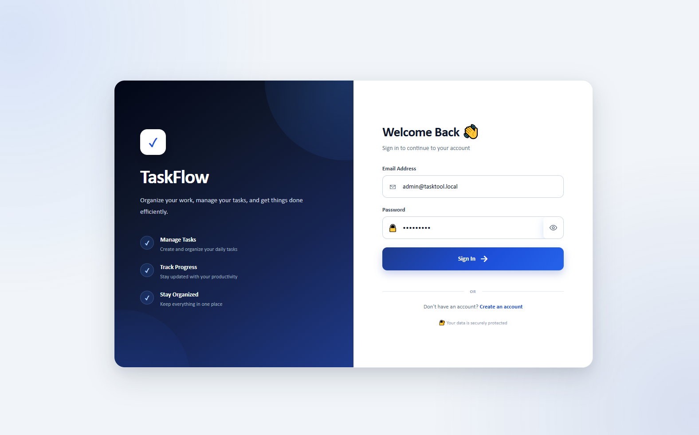
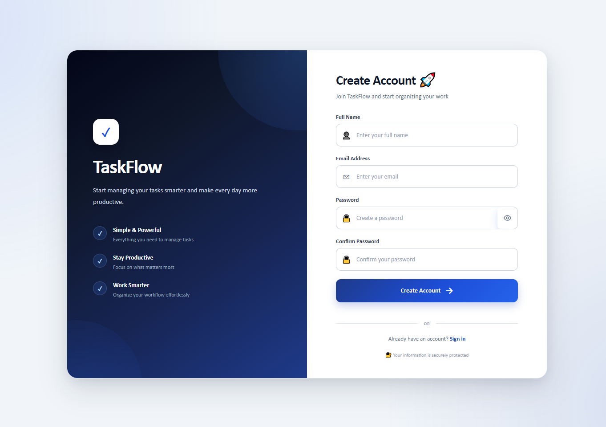
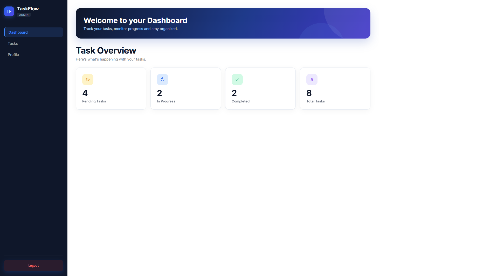
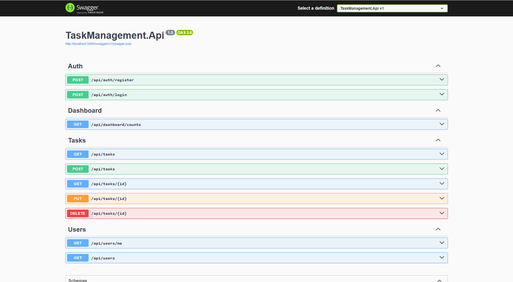
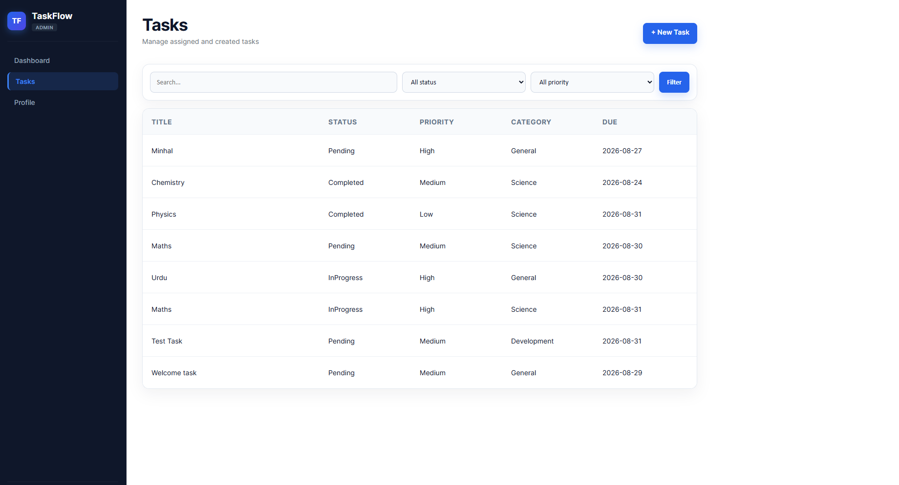
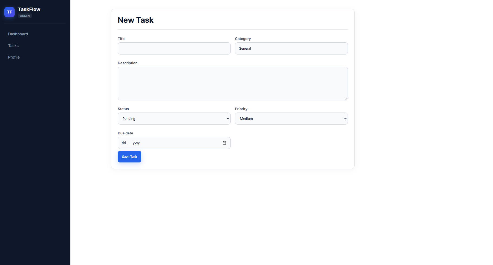
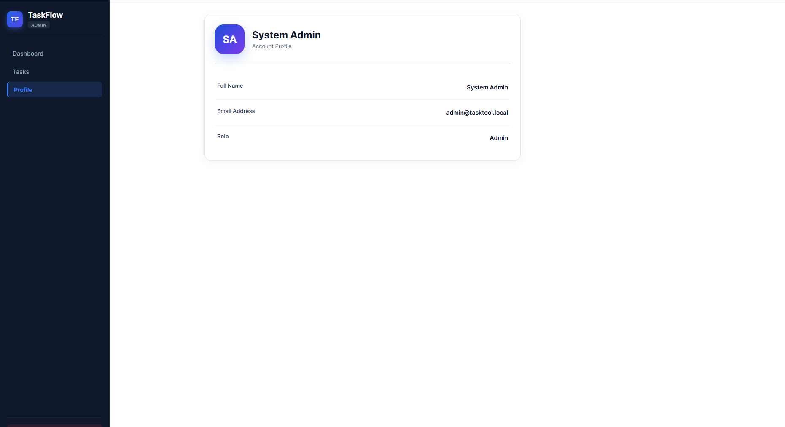
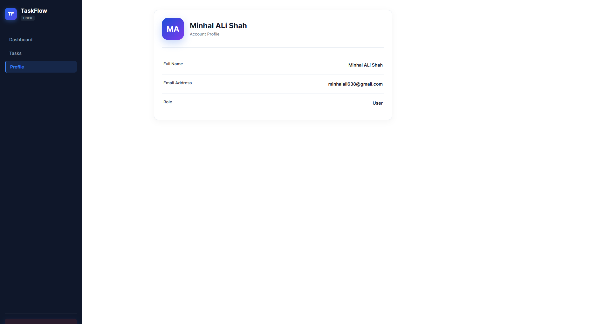

# 🚀 TaskFlow — Task Management Tool

A modern full-stack task management application built to help users create, organize, track, and complete their work efficiently.

TaskFlow combines a **React + TypeScript frontend** with an **ASP.NET Core 8 Web API**, **Entity Framework Core**, and **SQL Server**. It includes secure JWT authentication, task CRUD operations, dashboard statistics, comments, tags, activity logging, and role-based access.

## ✨ Features

- 🔐 User registration and login
- 🛡️ JWT authentication and role-based authorization
- 📋 Create, view, update, and delete tasks
- 📊 Dashboard with pending, in-progress, completed, and total task counts
- 🔎 Task search and filtering
- 🏷️ Task tags and tag management
- 💬 Task comments
- 📝 Task activity/history tracking
- 👤 User profile page
- ⚠️ Global exception handling
- 📄 Swagger / OpenAPI API documentation
- 🪵 Serilog application logging
- 🧪 xUnit unit tests
- 🔍 SonarQube project configuration

## 🛠️ Technology Stack

### Backend

- C#
- ASP.NET Core 8 Web API
- Entity Framework Core 8
- SQL Server
- JWT Bearer Authentication
- BCrypt.Net
- Serilog
- Swagger / OpenAPI

### Frontend

- React 19
- TypeScript
- Vite
- React Router
- Axios
- CSS

### Testing & Quality

- xUnit
- Entity Framework Core InMemory
- SonarQube

## 🖥️ Screenshots

### Login



### Create Account



### Dashboard



### Swagger



### Tasks



### Create Tasks



### Admin Profile



### User Profile




## 📁 Project Structure

```text
📁 Project Structure
Task Management Tool/
│
├── backend/
│   ├── TaskManagement.Api/
│   │   ├── Controllers/
│   │   │   ├── AuthController.cs
│   │   │   ├── CommentsController.cs
│   │   │   ├── DashboardController.cs
│   │   │   ├── TagsController.cs
│   │   │   ├── TasksController.cs
│   │   │   └── UsersController.cs
│   │   │
│   │   ├── Data/
│   │   │   ├── AppDbContext.cs
│   │   │   └── DbSeeder.cs
│   │   │
│   │   ├── Middleware/
│   │   │   └── ExceptionHandlingMiddleware.cs
│   │   │
│   │   ├── Models/
│   │   │   ├── Entities.cs
│   │   │   └── Dtos.cs
│   │   │
│   │   ├── Services/
│   │   │   ├── ActivityLogService.cs
│   │   │   ├── AuthService.cs
│   │   │   ├── CommentService.cs
│   │   │   ├── DashboardService.cs
│   │   │   ├── JwtTokenService.cs
│   │   │   ├── TagService.cs
│   │   │   └── TaskService.cs
│   │   │
│   │   ├── Migrations/
│   │   ├── Program.cs
│   │   ├── appsettings.json
│   │   └── TaskManagement.Api.csproj
│   │
│   ├── TaskManagement.Tests/
│   │   ├── AuthServiceTests.cs
│   │   ├── CommentServiceTests.cs
│   │   ├── TagServiceTests.cs
│   │   └── TaskServiceTests.cs
│   │
│   └── TaskManagement.sln
│
├── frontend/
│   ├── src/
│   │   ├── components/
│   │   │   ├── Layout.tsx
│   │   │   └── TaskFormFields.tsx
│   │   │
│   │   ├── pages/
│   │   │   ├── Dashboard.tsx
│   │   │   ├── Login.tsx
│   │   │   ├── Profile.tsx
│   │   │   ├── Register.tsx
│   │   │   ├── TaskDetail.tsx
│   │   │   ├── TaskForm.tsx
│   │   │   └── Tasks.tsx
│   │   │
│   │   ├── css/
│   │   ├── api.ts
│   │   ├── auth.tsx
│   │   ├── types.ts
│   │   ├── App.tsx
│   │   └── main.tsx
│   │
│   ├── package.json
│   ├── vite.config.ts
│   └── tsconfig.json
│
├── screenshots/
│
├── scripts/
│   ├── run-backend.ps1
│   ├── run-backend.sh
│   ├── run-frontend.ps1
│   ├── run-frontend.sh
│   ├── sonar-all.ps1
│   ├── sonar-backend.ps1
│   ├── sonar-frontend.ps1
│   └── start-sonarqube.ps1
│
├── docker-compose.yml
├── sonar-project.properties
└── README.md
```

## ⚙️ Prerequisites

Install the following before running the project:

- [.NET 8 SDK](https://dotnet.microsoft.com/download/dotnet/8.0)
- [Node.js](https://nodejs.org/)
- npm
- SQL Server
- Git

## 🚀 Getting Started

### 1. Clone the repository

```bash
git clone https://github.com/Minhalalishah/cohort-9-dotnet-8172-hafiz.git
cd TaskManagementTool
```

### 2. Configure the backend

Open:

```text
backend/TaskManagement.Api/appsettings.json
```

Configure your SQL Server connection string and JWT settings for your local environment.

> ⚠️ Never commit real passwords, production secrets, API keys, or JWT signing keys to GitHub.

### 3. Run the backend

```bash
cd backend
dotnet restore
dotnet build
dotnet run --project TasManagement.Api
```

Swagger/OpenAPI will be available from the URL shown by ASP.NET Core when the application starts.

### 4. Run the frontend

Open another terminal:

```bash
cd frontend
npm install
npm run dev
```

Vite will display the local development URL in the terminal, normally:

```text
http://localhost:5173
```

## 🧪 Run Tests

From the test project directory:

```bash
dotnet test
```

## 🔑 Authentication Flow

```text
User
  │
  ▼
React + TypeScript
  │
  │ Axios / HTTP
  ▼
ASP.NET Core Web API
  │
  ├── JWT Authentication
  ├── Authorization
  ├── Services
  └── Entity Framework Core
           │
           ▼
       SQL Server
```


## 🔍 Code Quality

The repository includes `sonar-project.properties` for SonarQube analysis and configuration.


## 👨‍💻 Author

**Hafiz Syed Minhal Ali**  
**Cohort:** 9 .NET-8172-hafiz

